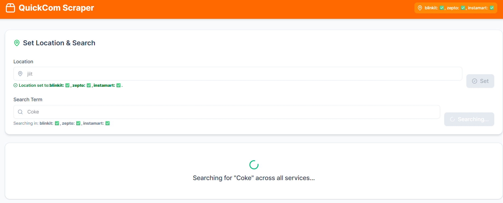
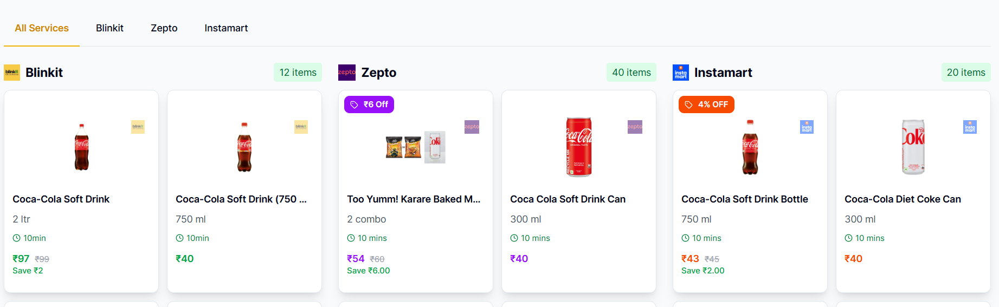

# QuickCom Scraper

QuickCom is a web application that helps you find and compare product prices across Blinkit, Zepto, and Swiggy Instamart. Instead of checking each app individually, you can search once and see all the options, saving you time and money when ordering groceries or essentials.

## Demo

### Location Setting & Search Interface


### Product Results Across Platforms


## Features

- **Multi-platform Search**: Find products across multiple platforms with one search
- **Location-based Results**: Set your location once to get accurate delivery options
- **Real-time Comparison**: See prices and delivery times side by side
- **Visual Indicators**: Easily spot discounts and best deals
- **Responsive Design**: Works well on both desktop and mobile
- **Live Updates**: Results appear as they're found thanks to WebSocket integration
- **Complete Product Info**: See quantity, price, discounts, and delivery times

## Project Structure

```
QuickCom/
├── backend/                   # Node.js backend server
│   ├── blinkit/               # Blinkit-specific code
│   │   ├── searchHelpers.js   # Search and data extraction
│   │   └── set-location.js    # Location handling
│   ├── zepto/                 # Zepto-specific code
│   │   ├── searchHelpers.js   # Search and data extraction
│   │   └── set-location.js    # Location handling
│   ├── instamart/             # Swiggy Instamart-specific code
│   │   ├── searchHelpers.js   # Search and data extraction
│   │   └── set-location.js    # Location handling
│   ├── server.js              # Main server file
│   └── package.json           # Dependencies
├── frontend/                  # React frontend
│   ├── src/
│   │   ├── components/        # UI components
│   │   │   ├── SearchForm.tsx # Search interface
│   │   │   ├── ProductList.tsx # Product display
│   │   │   └── ui/            # UI elements
│   │   ├── assets/            # Images and icons
│   │   ├── App.tsx            # Main app component
│   │   └── main.tsx           # Entry point
│   └── package.json           # Dependencies
└── README.md                  # This documentation
```

## Technology Stack

### Backend
- **Node.js** - JavaScript runtime
- **Express** - Web framework
- **WebSocket** - Real-time communication
- **Puppeteer** - Web automation and scraping
- **dotenv** - Environment configuration

### Frontend
- **React** - UI framework
- **TypeScript** - Type-safe JavaScript
- **Tailwind CSS** - Styling framework
- **shadcn/ui** - Component library
- **Vite** - Build tool

### Installation

1. **Clone the Repository:**
```bash
git clone https://github.com/yourusername/QuickCom.git
cd QuickCom
```

2. **Install Backend Dependencies:**
```bash
cd backend
npm install
```

3. **Install Frontend Dependencies:**
```bash
cd frontend
npm install
```

### Running the Application

1. **Start the Backend Server:**
```bash
cd backend
npm start
```
The backend will run on `http://localhost:5000`

2. **Start the Frontend Development Server:**
```bash
cd frontend
npm run dev
```
The frontend will run on `http://localhost:5173`

3. **Access the Dashboard:**
Open your browser and navigate to `http://localhost:5173`

## 📝 License

This project is licensed under the MIT License - see the LICENSE file for details.

---

Happy shopping and happy scraping! 🚀
